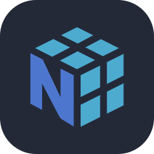

<div align="center">


# Hi, I'm Uday Kumar Choudhary

### AI & ML Engineer — Full-Stack Developer — Data Science
### B.Tech in Artificial Intelligence & Machine Learning | Newton School of Technology (ADYPU) | CGPA: 8.67


</div>

---

<div align="center">
<table>
  <tr>
    <td valign="top" width="58%">

## About Me

```javascript
const uday = {
  location: "Pune, Maharashtra, India",
  degree: "B.Tech in AI & ML — Newton School of Technology (ADYPU)",
  cgpa: "8.67 / 10.0",
  focus: ["ML Pipelines", "Agentic AI", "Full-Stack Development"],
  currentlyBuilding: ["RAG systems", "LangGraph workflows", "MERN apps"],
  openSource: "Merged PRs into Deno — production-level bug fixes",
  certifications: ["Generative AI for Everyone", "AI For Everyone"],
  email: "uday.choudhary@adypu.edu.in"
};
```

- AI Engineering student with hands-on experience in **Machine Learning**, **Full-Stack Development**, and **autonomous AI systems**
- Built end-to-end ML pipelines, **RAG architectures**, and **agentic workflows** using LangChain, LangGraph, and scikit-learn
- Developed production-grade **MERN applications** with Stripe payment integration and background job processing
- Merged pull requests into **Deno** repositories, fixing bugs in production-level code
- Selected to **mentor 15 junior students** on full-stack development and ML fundamentals
- Reached finals in **inter-college debate competitions** via the Orators Club

</td>
<td valign="top" width="42%" align="center">


<br/>

## Connect With Me

<table align="center">
  <tr>
    <td align="center" width="80">
      <a href="https://github.com/Uday-Choudhary" target="_blank">
        
      </a>
      <br/>GitHub
    </td>
    <td align="center" width="80">
      <a href="https://www.linkedin.com/in/uday-kumar-choudhary/" target="_blank">
        
      </a>
      <br/>LinkedIn
    </td>
    <td align="center" width="80">
      <a href="mailto:uday.choudhary@adypu.edu.in">
        
      </a>
      <br/>Email
    </td>
    <td align="center" width="80">
      <a href="https://leetcode.com/u/uday_choudhary_29/" target="_blank">
        
      </a>
      <br/>LeetCode
    </td>
  </tr>
</table>

<br/>

> *"Stay hungry, stay foolish."* — Steve Jobs

</td>
  </tr>
</table>
</div>

---

## Tech Stack

<div align="center">

### Languages & Frameworks
<table>
  <tr>
    <td align="center" width="96"><br>Python</td>
    <td align="center" width="96"><br>JavaScript</td>
    <td align="center" width="96"><br>TypeScript</td>
    <td align="center" width="96"><br>React</td>
    <td align="center" width="96"><br>Node.js</td>
    <td align="center" width="96"><br>HTML5</td>
    <td align="center" width="96"><br>CSS3</td>
    <td align="center" width="96"><br>Tailwind</td>
  </tr>
</table>

### AI / ML
<table>
  <tr>
    <td align="center" width="96"><br>Scikit-learn</td>
    <td align="center" width="96"><br>Pandas</td>
    <td align="center" width="96"><br>NumPy</td>
    <td align="center" width="96"><br>OpenCV</td>
    <td align="center" width="96"><br>Streamlit</td>
  </tr>
</table>

### Databases & Backend
<table>
  <tr>
    <td align="center" width="96"><br>MySQL</td>
    <td align="center" width="96"><br>MongoDB</td>
    <td align="center" width="96"><br>PostgreSQL</td>
    <td align="center" width="96"><br>Supabase</td>
    <td align="center" width="96"><br>Prisma</td>
    <td align="center" width="96"><br>Express</td>
  </tr>
</table>

### Tools & DevOps
<table>
  <tr>
    <td align="center" width="96"><br>Git</td>
    <td align="center" width="96"><br>Docker</td>
    <td align="center" width="96"><br>VS Code</td>
    <td align="center" width="96"><br>Figma</td>
    <td align="center" width="96"><br>Postman</td>
    <td align="center" width="96"><br>Vite</td>
  </tr>
</table>

</div>

---

## GitHub Analytics

<div align="center">

|  |  |  |
|:-:|:-:|:-:|

|  |  |
|:-:|:-:|

</div>

---

## GitHub Trophies

<div align="center">


</div>

---

## Activity Graph

<div align="center">


</div>

---

## Contribution Snake

<div align="center">


</div>

---

## Holopin Badges

<div align="center">

[](https://holopin.io/@udaychoudhary)

</div>

---

<div align="center">


<br/>


### Thanks for visiting!

</div>
